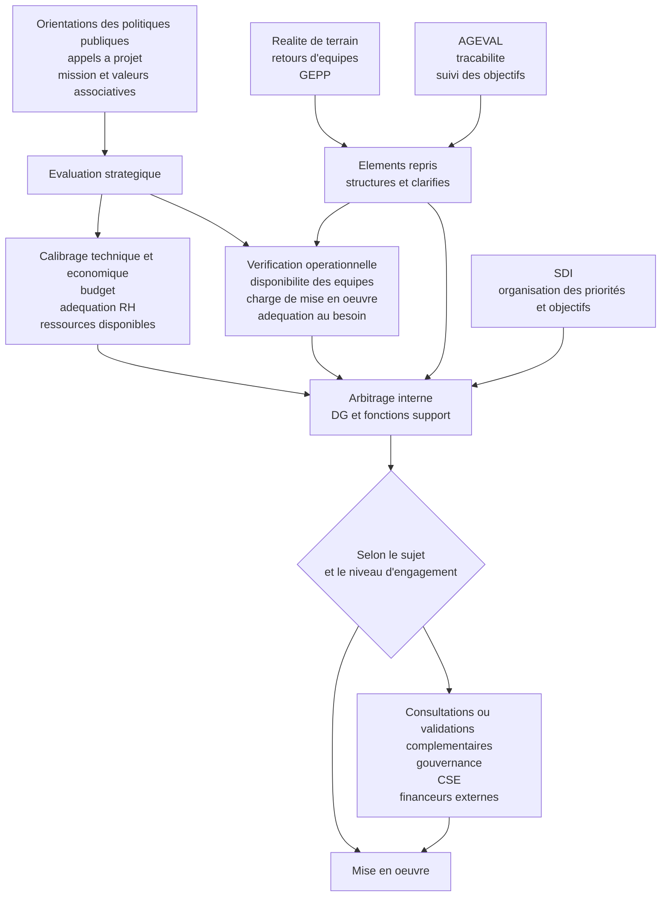

# Schéma décisionnel AAJD

```mermaid
flowchart TD
    A[Orientations des politiques publiques<br/>appels a projet<br/>mission et valeurs associatives] --> B[Evaluation strategique]
    B --> C[Calibrage technique et economique<br/>budget<br/>adequation RH<br/>ressources disponibles]
    B --> D[Verification operationnelle<br/>disponibilite des equipes<br/>charge de mise en oeuvre<br/>adequation au besoin]
    C --> E[Arbitrage interne<br/>DG et fonctions support]
    D --> E

    H[Realite de terrain<br/>retours d'equipes<br/>GEPP] --> I[Elements repris<br/>structures et clarifies]
    I --> D
    I --> E

    J[AGEVAL<br/>tracabilite<br/>suivi des objectifs] --> I
    K[SDI<br/>organisation des priorités et objectifs] --> E

    E --> L{Selon le sujet<br/>et le niveau d'engagement}
    L --> M[Mise en oeuvre]
    L --> N[Consultations ou validations complementaires<br/>gouvernance<br/>CSE<br/>financeurs externes]
    N --> M
```