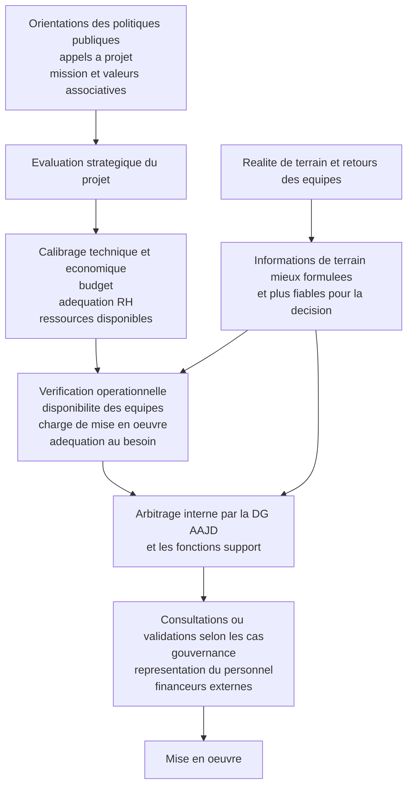

# Schéma décisionnel AAJD

```mermaid
flowchart TD
    A[Orientations des politiques publiques<br/>appels a projet<br/>mission et valeurs associatives] --> B[Evaluation strategique du projet]
    B --> C[Calibrage technique et economique<br/>budget<br/>adequation RH<br/>ressources disponibles]
    C --> D[Verification operationnelle<br/>disponibilite des equipes<br/>charge de mise en oeuvre<br/>adequation au besoin]
    D --> E[Arbitrage interne par la DG AAJD<br/>et les fonctions support]
    E --> F[Consultations ou validations selon les cas<br/>gouvernance<br/>representation du personnel<br/>financeurs externes]
    F --> G[Mise en oeuvre]

    H[Realite de terrain et retours des equipes] --> I[Informations de terrain mieux formulees<br/>et plus fiables pour la decision]
    I --> D
    I --> E
```